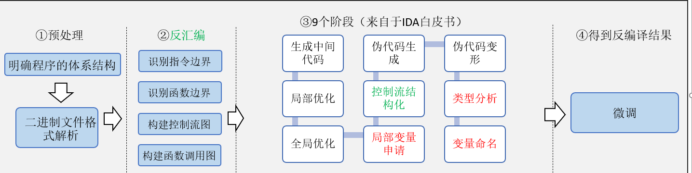
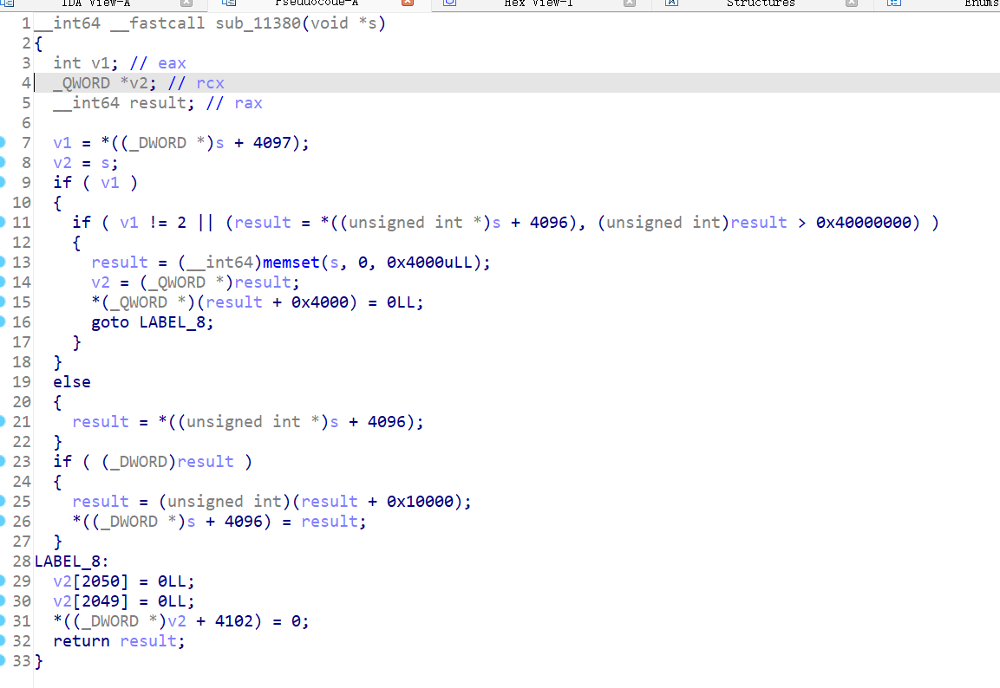

#  Control-flow Structing

## About  Control-flow Structing 

 根据IDA白皮书，可以得到大致的反编译器流程如下：




控制流结构化：指的是恢复高层伪代码的语法控制结构，例如：if-else，for，while结构等等。 控制流结构化是反编译中基础且关键的一环。

## Main
1. src目录基于IDA microcode实现了一大半的 “no more goto” 的算法；
2. 代码写的很烂，后续有时间继续优化；
3. 非sese region的处理部分暂未处理；
4. 对于条件变量的声明和处理部分我觉得还需思考（条件表达式的处理）

## Example

lz4-s IDA F5效果：




运行 .\src\run.bat 之后的效果（没有goto语句）: 

```c
void sub_11380() 
{
	block0
    if(!Block3 || !Block2)
    {
        block4
        block5
    }
    if(!Block1)
    {
        block6
    }
    if(!Block3 || !Block1)
    {
        if(block7)
        {
            block8
        }
        
    }
    block9
    block10
}
```

## Discussion

相比于Ghidra， IDA (7.6及之前) Control-flow Structing做的较差。 原因有以下2点：
1. IDA 对try-except 以及 C++的SEH 不做处理，代码经常缺一块；
2. IDA的noreturn函数识别效果极差

noreturn函数识别存在以下2中错误 ：
1. 本来是noreturn函数但是未识别出来
2. 将不是noreturn的函数识别出了noreturn函数

上述的2中出现的一种情况是：
1. 一个函数指针 fptr 被赋予了一个noreturn函数的地址 , 即 `fptr= (__noreturn) func_addr; `
2. 接下来所有的call fptr指令，IDA都会认为fptr指向的是 noreturn函数，即认为 `（__noreturn）fptr();`
3. 然而函数指针即使存在默认值，也可能在运行时被动态修改，因此这样的分析是错误的。

Ghidra不存在以上的所有问题。

而IDA相比于Ghidra相对强大的地方：

1. 优秀的人机交互，尤其是xref
2. 强大的idapython，尤其是18年开放了更为优秀的IR -- microcode

Ghidra的pcode看上去和microcode差不了太多，但感觉API不像microcode那么简洁明了，关键是缺少API详细的文档。

## Ghidra's  Control-flow Structing Implement

Ghidra's  控制流结构化实现参考r2的相关代码:  (r2ghidra 整个突出一个乱字)

https://github.com/radareorg/ghidra-native/blob/e2244428369498af3e84d32713ce85b408624d34/src/decompiler/blockaction.cc#L1748

关键函数:  int4 CollapseStructure::collapseInternal(FlowBlock *targetbl)

这里我觉得IDA和Ghidra的实现不会差太多，对结构化控制流的实现主要基于patten match，而不是像no more goto一样基于大量的图理论。

## No More Goto已有的开源实现

我写完这部分代码之后发现了dewolf， dewolf的代码看上去比我写的好多了，看上去也有简单的类型推断及条件表达式的合并，是一份好的参考。 

https://github.com/fkie-cad/dewolf

## Reference

1. No More Gotos: Decompilation Using Pattern-Independent Control-Flow Structuring and Semantics-Preserving Transformations -- (ndss 2015)
2. A Comb for Decompiled C Code --(AsiaCCS 2020  另一种实现思路，我觉得存在一定弊端)
3. https://github.com/zeroKilo/DirectedGraphsWV/blob/master/How%20to%20write%20a%20basic%20control%20flow%20decompiler.pdf
4. https://medium.com/leaningtech/solving-the-structured-control-flow-problem-once-and-for-all-5123117b1ee2
5. https://infocon.org/cons/Black%20Hat/Black%20Hat%20USA/Black%20Hat%20USA%202008/conference%20cd/speakers/Guilfanov_Decompilers_and_Beyond/BH_US_08_Guilfanov_Decompilers_and_Beyond_white_paper.pdf --(08年IDA白皮书)
4. https://i.blackhat.com/us-18/Thu-August-9/us-18-Guilfanov-Decompiler-Internals-Microcode-wp.pdf --(18年microcode文档，配合08年白皮书一起看)
4. [INFILTRATE2019/INFILTRATE Ghidra Slides.pdf at master · 0xAlexei/INFILTRATE2019 · GitHub](https://github.com/0xAlexei/INFILTRATE2019/blob/master/INFILTRATE Ghidra Slides.pdf) （Ghidra pcode相关）
